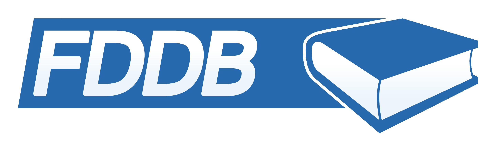

# n8n-nodes-fddb

  
  

  
  

  

This is an n8n community node. It lets you use Fddb in your n8n workflows.

[Fddb](https://fddb.info/) is a food diary database app by Food Database GmbH.

[n8n](https://n8n.io/) is a fair-code licensed workflow automation platform.

> [!NOTE]
> This project is a university project and is not affiliated with, endorsed by, or connected to Fddb (Food Database GmbH) in any way.

## Installation

Follow the [installation guide](https://docs.n8n.io/integrations/community-nodes/installation/) in the n8n community nodes documentation.

## Credentials

To use this node, you need to configure the **Fddb API** credentials.

1.  Create a new credential for **Fddb API**.
2.  Enter your **Username** and **Password** for your Fddb account.
3.  Enter your **API Key**.

## Operations

### User

- **Get Profile**: Retrieve your user profile information.
- **Get Weight History**: Retrieve your weight history.

### Food

- **Search**: Search for food items in the Fddb database.

### Diary

- **Get Interval**: Get diary entries for a specific time interval (Start Date to End Date).
- **Track Food Item**: Add items to your diary.
  - Requires `Items` collection with:
    - `Item ID`
    - `Timestamp`
    - `Custom Serving` (Amount in grams or portion)

## Compatibility

- n8n v1.0.0 or later

## License

MIT
